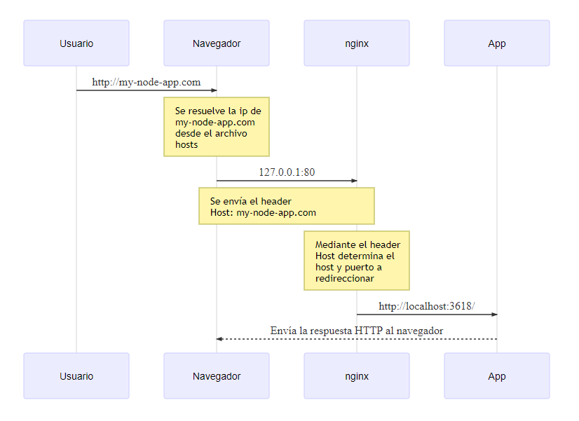
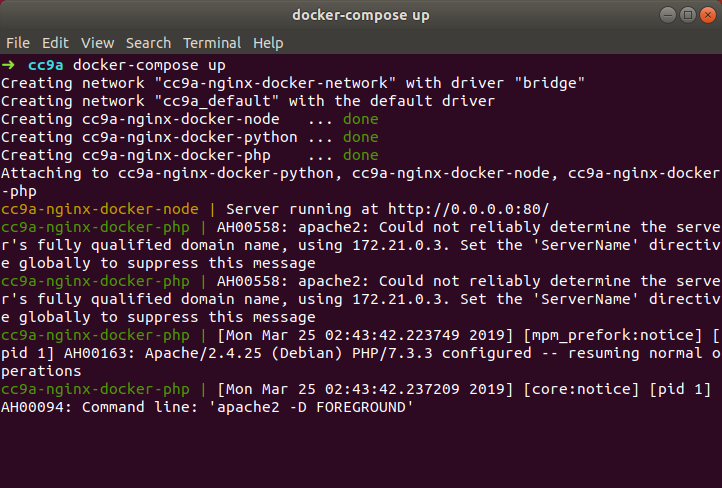
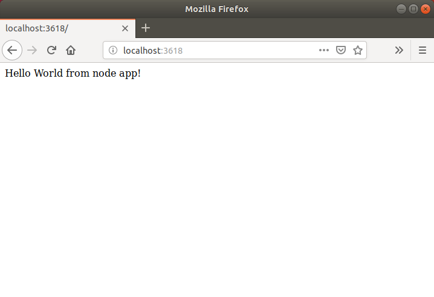
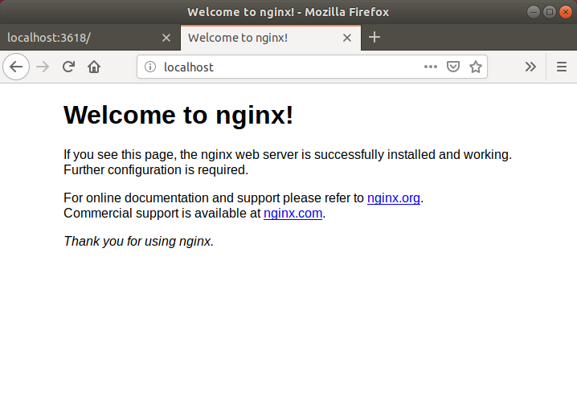
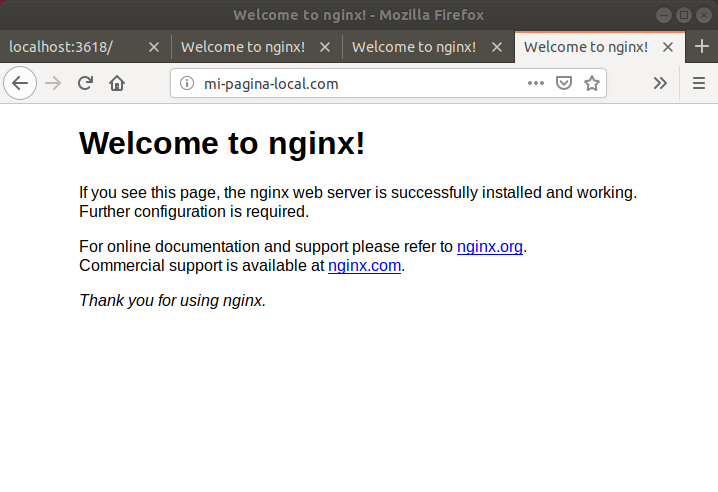
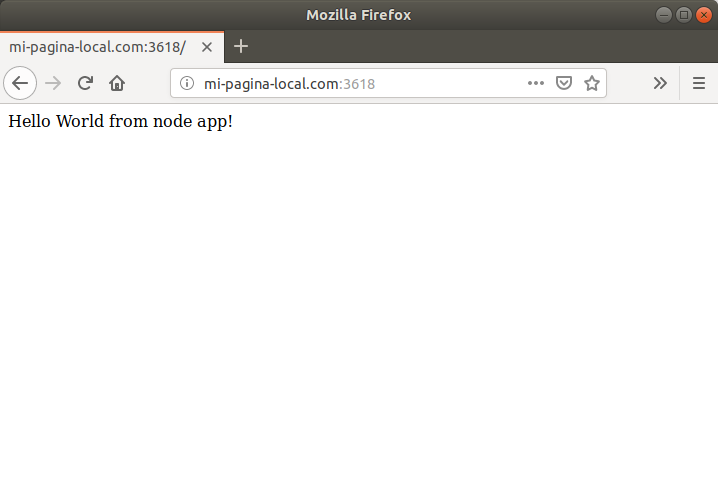
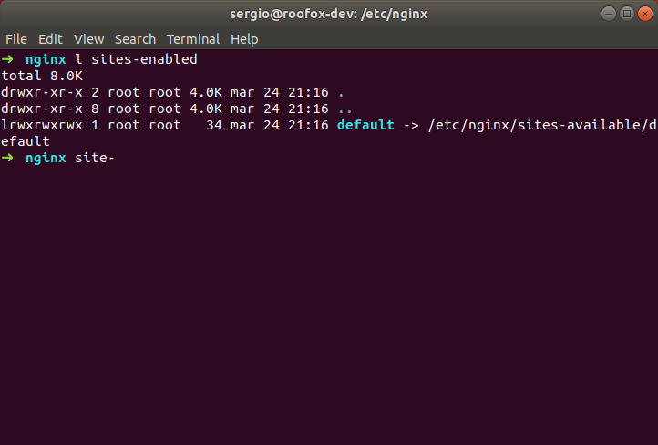
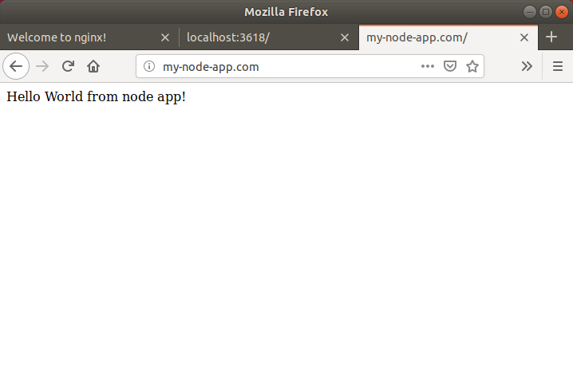

Todos los programadores web conocemos perfectamente el concepto de qué es *localhost*, ya que diariamente trabajamos con el para acceder y probar nuestros sitios web.

> *localhost* es el nombre del equipo local o _"este equipo"_ el cual tiene la dirección IP _127.0.0.1_.

Como todos sabemos, si ingresamos la URL http://localhost/ en el navegador estaremos accediendo al puerto 80 del equipo local y si tenemos un servidor web como [apache][apache] o [nginx][nginx] escuchando en ese puerto es probable que el navegador web nos muestre el sitio web que se encuentre configurado o en su defecto una página de bienvenida del servidor web.

Y bueno, no es muy común ejecutar aplicaciones en el puerto 80 cuando estamos programando, generalmente utilizamos otro puerto como el 3000 o similares, esto nos proporciona la ventaja de ejecutar varias aplicaciones en el equipo local sin necesidad de tener un servidor remoto para la ejecución de cada aplicación.

Un caso muy común hoy en día es el programar el frontend y el backend como proyectos separados, cada uno ejecutandose en un puerto independiente, lo que nos lleva a tener que utilizar dos URLs del tipo _localhost:&lt;puerto&gt;_, pero, _¿no sería genial poder utilizar algo como http://superhero-app.com/ para acceder al frontend y http://api.superhero-app.com para la API/backend?_ Podemos hacerlo 😎.

## Primeros pasos

El objetivo de este ejemplo es el de realizar un redireccionamiento utilizando [nginx][nginx] para que cuando ingresemos a http://my-node-app.com internamente el servidor web redireccione las peticiones a la direción y puerto local expuestas por [docker][docker] (o cualquier otro proyecto ejecutandose en la maquina local).

El flujo general — el que al final de esta publicación deberías entender mejor — es a como se muestra en el siguiente diagrama:



## Sofware necesario

Utilizaremos un ambiente linux para la demostración del ejemplo, [ubuntu][ubuntu] `v18.04.2 LTS` será el sistema operativo y necesitaremos la instalación de los siguientes programas:

- [docker][docker] `v18.09.3`
- [docker-compose][docker-compose] `v1.23.2`
- [git][git] `v2.17.1`

> Este ejemplo puede ejecutarse fácilmente en otros sistemas operativos como `Windows` o `macOS` siguiendo la mayoría de las instrucciones.

## Ejecutar las aplicaciones de ejemplo

Vamos a crear un archivo [`docker-compose.yml`](https://github.com/roofox/cc9a-nginx-docker/blob/master/docker-compose.yml) en la ruta que prefieras al cual agregarás el siguiente contenido:

```yaml
version: "3.5"
services:
    node:
        container_name: cc9a-nginx-docker-node
        image: roofox/cc9a-nginx-docker-node:0.1
        ports:
            - "3618:80"
        networks: 
            - nginx-docker-network
    python:
        container_name: cc9a-nginx-docker-python
        image: roofox/cc9a-nginx-docker-python:0.1
        ports:
            - "3620:80"
    php:
        container_name: cc9a-nginx-docker-php
        image: roofox/cc9a-nginx-docker-php:0.1
        ports:
            - "3622:80"
networks:
    nginx-docker-network:
        name: cc9a-nginx-docker-network
        driver: bridge
```

Como puedes ver, estamos creando tres servicios en los cuales vamos a exponer en un puerto diferente un servidor web utilizando lenguajes de programación diferentes, en cada servicio se mostrará un texto de ejemplo generado desde cada uno de ellos.

Vamos a posicionarnos desde la línea de comandos en el directorio donde creamos el archivo `docker-compose.yml` y ejecutaremos el comando `docker-compose up`.

[Docker](docker) comenzará a descargar las imagenes de los servicios (tardará unos cuantos minutos) para finalmente mostrarlos en ejecución.





Si ingresamos en un navegador web con cada uno de los puertos (`3618`, `3620` y `3622`) veremos el mensaje que despliega cada uno de los servicios así como el saber que se encuentra en ejecución.



Y bueno, tres servicios ejecutandose en diferentes puertos del equipo local, es hora de comenzar con los pasos para el redireccionamiento.

## Instalar nginx

Vamos a comenzar instalando [nginx][nginx] utilizando los siguientes comandos en la terminal.

```shell
sudo apt-get update
sudo apt-get install nginx
```

Después de la instalación procedemos a ingresar en el navegador web la url [http://localhost](http://localhost) donde deberás ver lo siguiente:



Esta es la página de bienvenida de [nginx][nginx], lo que nos indica que el servidor web está en ejecución y se encuentra en escucha utilizando el puerto `80`.

## Deshaciéndonos de localhost

Como ya lo mencionamos, _localhost_ es el **hostname** del equipo local que está asignado a la dirección IP __127.0.0.1__, esta asignación se realiza a nivel sistema operativo gracias a un archivo de configuración de nombre **hosts** que dependiendo de cada sistema operativo se encuentra en [diferente ubicación][host-file-location], este archivo es del tipo texto plano, lo que significa que lo puedes vizualizar y modificar con tu editor de textos preferido.

Minimamente, este archivo contiene algo similar a lo siguiente:

```vim
127.0.0.1  localhost
::1        localhost
```

La configuración anterior es tan simple como decir que el hostname _localhost_ está asingado a la dirección IP _127.0.0.1_, si agregamos cualquier hostname después de  _localhost_ estaremos asignando ese host a la dirección IP 127.0.0.1.

> **NOTA: El archivo hosts es un archivo del sistema operativo, por lo que si quieres modificarlo deberás hacerlo con permisos de administrador o root.**

Vamos, edita el archivo `/etc/hosts` y agrega el hostname _mi-pagina-local.com_ y luego ingresa a esa URL en el navegador.

```vim
127.0.0.1  localhost mi-pagina-local.com
::1        localhost
```

Verás que se muestra lo mismo que al entrar a http://localhost/.



Y si agregas uno de los puertos de los servicios, también verás lo mismo.



Ahora bien, podemos sacar ventaja de esto para dejar de acceder a las aplicaciones web utilizando el hostname **localhost** y podemos utilizar algo como lo que mencioné anteriormente. Vamos a agregar una nueva configuración al archivo hosts para mapear la dirección IP local con unos nuevos hostnames:

```vim
127.0.0.1  localhost mi-pagina-local.com
::1        localhost

# Configuración de host para aplicaciones
127.0.0.1  my-node-app.com
127.0.0.1  my-python-app.com
127.0.0.1  my-php-app.com
```

Probemos acceder a cualquiera de los hostnames que definimos en el archivo anterior con el navegador web, veremos que de igual manera aparece lo mismo que al ingresar a http://localhost/ y si agregamos los puertos de los servicios también funcionará.

## Proxy Pass — o redireccionando el tráfico —

[nginx](nginx) permite redireccionar el tráfico de una URL hacia otra utilizando la directiva [proxy_pass][proxy-pass] del módulo `ngx_http_proxy_module`, es muy común utilizar está directiva para colocar varios servidores en un mismo espacio de URL.

Dentro del directorio `/etc/nginx/` se encuentra el archivo de configuración `nginx.conf`, si lo editamos veremos que en alguna parte de la sección `http` contiene lo siguiente:

```nginx
include /etc/nginx/conf.d/*.conf;
include /etc/nginx/sites-enabled/*;
```

Con esas líneas se están incluyendo todas las configuraciones que se encuentren dentro de esos directorios en la sección `http` del archivo principal, y si listamos el contenido del directorio `sites-enabled` veremos que el único archivo de nombre `default` es un elance simbólico haciendo referencia al archivo también de nombre `default` dentro del directorio `sites-available`.



Vamos a crear un archivo donde definiremos la configuración para uno de los servicios creados con [docker](docker), comenzaremos con el servicio de node.js, para ello hay que crear el archivo `/etc/nginx/sites-available/my-node-app.com` al cual agregaremos la siguiente configuración:

> **NOTA: El directorio `/etc/nginx` es un directorio en el que solamente se pueden crear ó modificar archivos con permisos de usuario root.**

```nginx
server {
	listen 80;
    listen [::]:80;

    server_name my-node-app.com;

    location ^~ / {
        proxy_pass http://localhost:3618;
    }
}
```
Ahora, crearemos un enlace simbólico de nombre `my-node-app.com` dentro del directorio `sites-enabled` que hará referencía al archivo posteriormente creado en el directorio `sites-available`

```shell
sudo ln -s /etc/nginx/sites-available/my-node-app.com /etc/nginx/sites-enabled/my-node-app.com
```

Con esto tenemos la configuración terminada y procederemos a reiniciar el servicio de [nginx](nginx) con el siguiente comando:

```shell
sudo nginx -s reload
```

Listo, ¡ingresa en el navegador web a http://my-node-app.com y verás lo mismo que el servicio ejecutandose en [http://localhost:3618](http://localhost:3618)!



## Funcionamiento de `proxy_pass` y `server_name`

La mágia que acabas de hacer, es posible gracias a las directivas [proxy_pass][proxy-pass] y [server_name][server-name] las cuales hacen que la configuración sea tan sencilla como hacer un **match** o **if**.

- El tag `server` define una nueva configuración de servidor
- Con el tag `listen 80` definimos que nginx escuche por el puerto 80.
- `server_name my-node-app.com` define el nombre del servidor, valor que se utilizará para compararlo con el header `host` que se envíe en la petición HTTP y mismo que definímos en el archivo `hosts` del sistema operativo.
- Con los tags `location ^~ /` y `proxy_pass http://localhost:3618;` definimos que cuando se acceda a la URL raíz ó `/` se realice el redireccionamiento de la petición HTTP al `host`:`puerto` especificados, en este caso `localhost`:`3618`.

```nginx
server {
	listen 80;
    listen [::]:80;

    server_name my-node-app.com;

    location ^~ / {
        proxy_pass http://localhost:3618;
    }
}

```

## Terminando

Para finalizar, realiza exactamente los mismos pasos para los dos servicios restantes, creando dos nuevos archivos de configuración y cambiando los valores de las directivas `proxy_pass` y `server_name`.

Ahora si puedes revisar nuevamente el diagrama del inicio para que entiendas un poco mas el proceso de redireccionamiento y si quieres conocer mas sobre las configuraciones que puedes hacer con [nginx][nginx] puedes revisar la documentación de [proxy_pass][proxy-pass] y [server_name][server-name].


[apache]: https://httpd.apache.org/
[nginx]: https://nginx.org/
[ubuntu]: https://www.ubuntu.com/
[docker]: https://www.docker.com/
[docker-compose]: https://docs.docker.com/compose/
[git]: https://www.git-scm.com/
[proxy-pass]: https://nginx.org/en/docs/http/ngx_http_proxy_module.html#proxy_pass
[server-name]: https://nginx.org/en/docs/http/server_names.html
[host-file-location]: https://en.wikipedia.org/wiki/Hosts_(file)#Location_in_the_file_system